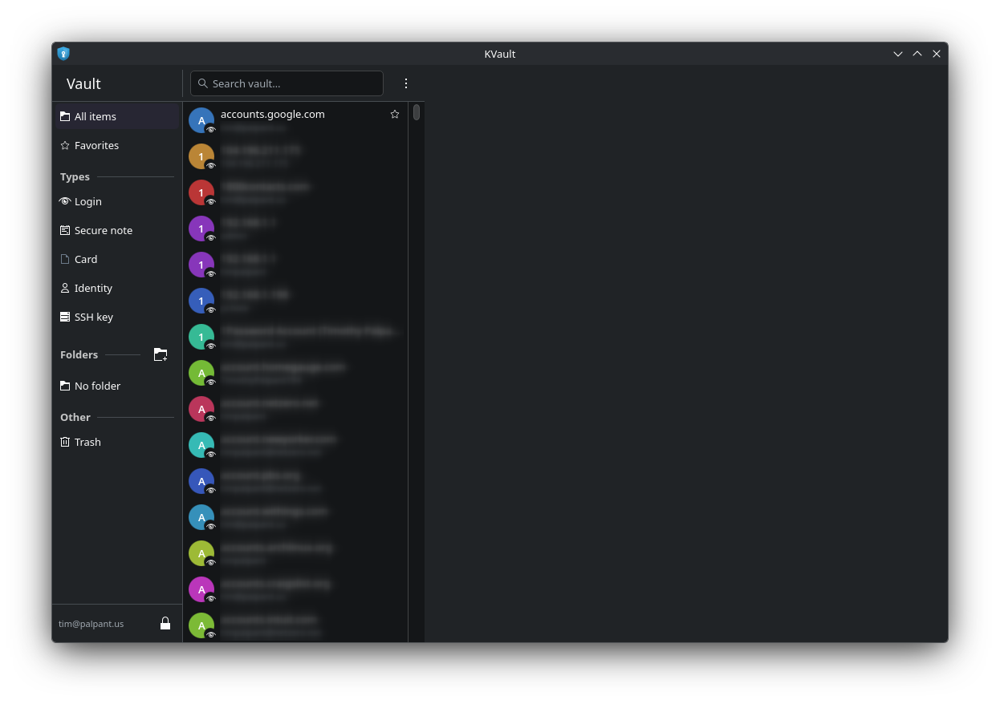
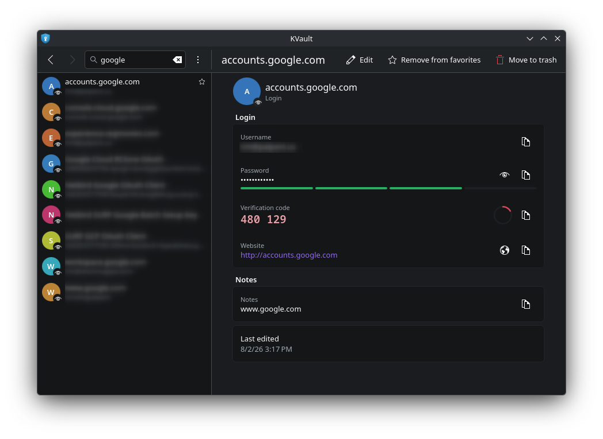
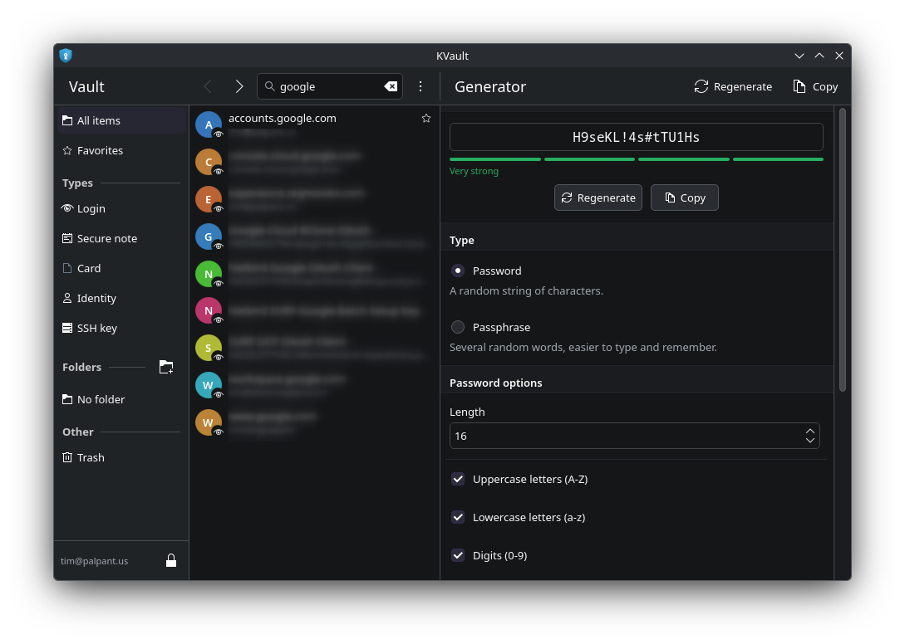

# KVault

[](https://github.com/timpalpant/kvault/actions/workflows/ci.yml)
[](https://github.com/timpalpant/kvault/releases)
[](LICENSE)

An unofficial native Kirigami/Qt client for Bitwarden vaults, for people who
would rather not run an Electron app to look at a password.

It speaks the Bitwarden API directly and does all cryptography locally with
OpenSSL and libargon2. There is no browser engine and no Node runtime.

**Website:** <https://timpalpant.github.io/kvault/>

> KVault is an independent project. It is not affiliated with, endorsed by, or
> sponsored by Bitwarden, Inc. "Bitwarden" is a trademark of Bitwarden, Inc.,
> referred to here only to describe the service this client interoperates with.

## Screenshots

<p align="center">
  
  
  
</p>

## Features

- **All item types** — logins, secure notes, cards, identities and SSH keys,
  including custom fields, multiple URIs and password history.
- **Full read/write** — create, edit, move to trash, restore and delete
  permanently; organize items into folders.
- **TOTP** — live verification codes with a countdown ring. Handles bare base32
  secrets, `otpauth://` URIs (SHA-1/256/512, custom digits and period) and Steam
  Guard codes.
- **Attachments** — downloaded and decrypted to a file you choose.
- **Offline cache** — the encrypted vault is kept on disk, so it stays readable
  and searchable without a network connection.
- **Generator** — passwords with configurable character classes and minimums, or
  passphrases from the EFF long wordlist.
- **Locking** — automatic lock when idle or on minimise, and clipboard entries
  that clear themselves.

Deliberately not included, per the original brief: Send, import and export.

## Installing

### Flatpak

Download `kvault.flatpak` from the [latest release](https://github.com/timpalpant/kvault/releases),
then:

```sh
flatpak install --user kvault.flatpak
flatpak run io.github.timpalpant.kvault
```

To build it yourself, install the matching KDE Platform and SDK, then:

```sh
flatpak-builder --user --install --force-clean \
    build-flatpak packaging/flatpak/io.github.timpalpant.kvault.ci.yml
```

### Arch Linux

Each release attaches a prebuilt `*.pkg.tar.zst`, if you would rather not
build locally:

```sh
sudo pacman -U kvault-*.pkg.tar.zst
```

The `PKGBUILD`s live in [`packaging/arch/`](packaging/arch/). To build a package
from a checkout, before any release exists:

```sh
./packaging/build-arch-package.sh      # -> dist/*.pkg.tar.zst
sudo pacman -U dist/kvault-*.pkg.tar.zst
```

That script uses the release `PKGBUILD` with its source repointed at the
current commit, so it exercises the same dependency list, build flags and
`check()` step as the released Arch package. It is what CI and the release
workflow run.

## Building

Dependencies: Qt 6.8+ (Quick, Network, Concurrent, DBus, Svg), KF6 (Kirigami,
I18n, CoreAddons), Kirigami Addons, qqc2-desktop-style, qtkeychain, OpenSSL 3
and libargon2.

On Arch:

```sh
sudo pacman -S --needed cmake ninja qt6-base qt6-declarative qt6-svg \
    kirigami kirigami-addons ki18n kcoreaddons qqc2-desktop-style \
    qtkeychain-qt6 openssl argon2
```

Then:

```sh
cmake -S . -B build -G Ninja -DCMAKE_BUILD_TYPE=Release
cmake --build build
ctest --test-dir build --output-on-failure
./build/bin/kvault
```

To build and test just the protocol and crypto core, with no GUI stack at all:

```sh
cmake -S . -B build-core -G Ninja -DKVAULT_BUILD_APP=OFF
cmake --build build-core && ctest --test-dir build-core
```

`extra-cmake-modules` is deliberately *not* required.

```sh
cmake --build build --target all_qmllint   # expected to be silent
clang-format -i $(git ls-files '*.cpp' '*.h')
```

`.qmllint.ini` disables only `UnqualifiedAccess`, because the `i18n*` functions
are injected into the QML context at runtime and cannot be resolved statically.
Every other check stays on, and CI treats warnings as failures.

## Security notes

- The master password is never written to disk, and is wiped from memory as
  soon as the keys are derived from it. Key material lives in a `SecureBytes`
  buffer with a cleansing allocator, so growing or freeing it does not leave
  copies on the heap.
- The on-disk cache is the server's sync payload exactly as received — still
  encrypted. Locking discards the keys, which makes the cache unreadable again.
- Session tokens go to KWallet or the Secret Service via qtkeychain, never to a
  file.
- Key derivation runs on a worker thread, so the window does not freeze for the
  second that 600,000 PBKDF2 rounds take.
- Copied secrets are tagged `x-kde-passwordManagerHint`, so Klipper keeps them
  out of its history, and are cleared after a configurable delay.
- No favicons are fetched. Item avatars are generated locally from the item
  name, because requesting a favicon would tell a third party which sites are
  in your vault.

## Known limitations

- **Two-step login**: authenticator apps, emailed codes and YubiKey OTP work.
  Duo and WebAuthn/security keys do not — they need a browser or a proprietary
  SDK. The two-factor page says so rather than failing silently.
- **Captcha-gated logins** cannot be completed here. Logging in once through the
  web vault clears the flag.
- **Organizations**: items shared with you decrypt and appear in the list, but
  there is no collection browser or sharing UI, and new items are always
  personal.
- **Master password reprompt** is stored and round-trips to other clients, but
  this app does not itself re-prompt before revealing a flagged item.
- **Attachments** can be downloaded, not added or removed.
- **The newer "v2" ciphertext format** (XChaCha20-Poly1305 in a COSE envelope,
  EncString type 7) is not implemented. Items arriving in that format are
  recognized and reported as such rather than misparsed or silently blanked,
  and every request carries a `Bitwarden-Client-Version` from before that
  rollout so the server keeps serving data this client can read. Override it
  with `KVAULT_CLIENT_VERSION=2026.1.0 kvault` if a server ever rejects the
  reported version as too old.
- One account at a time; no key rotation or password changes.

## License

GPL-3.0-or-later. The bundled EFF long wordlist is CC BY 3.0 US.

KVault is an unofficial client and is not affiliated with, endorsed by, or
supported by Bitwarden, Inc., the makers of Bitwarden.
